# VORA System Design - Mermaid Diagrams

> **⚠️ สำคัญ: วิธี Copy โค้ดที่ถูกต้อง**
> 
> เมื่อ copy โค้ดไปใช้ใน mermaid.live หรือ mermaidchart.com:
> - ✅ Copy **เฉพาะโค้ดข้างใน** (เริ่มจาก `graph TB` หรือ `sequenceDiagram`)
> - ❌ **อย่า** copy บรรทัด ` ```mermaid ` และ ` ``` `
> - ❌ **อย่า** copy มาพร้อม markdown code fence
>
> **ตัวอย่างที่ถูกต้อง:** เริ่มที่ `graph TB` จบที่ `fill:#f3e5f5`

---

## 🎯 1. System Overview - 3 Phase หลัก (แนะนำสำหรับนำเสนอ!)

### แบบง่าย - เข้าใจได้ภายใน 30 วินาที

**⚠️ Copy ตั้งแต่ `flowchart LR` ถึง `fill:#c8e6c9`**

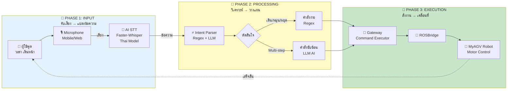

### แบบละเอียดขึ้นนิดนึง

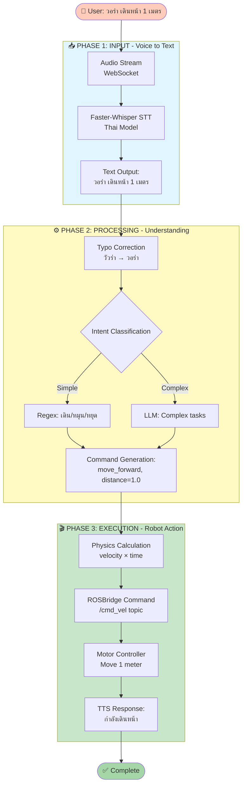

---

## 🔄 2. Workflow Diagram - แสดงการทำงานทีละขั้นตอน

**⚠️ แนะนำสำหรับอธิบายกระบวนการทำงาน**

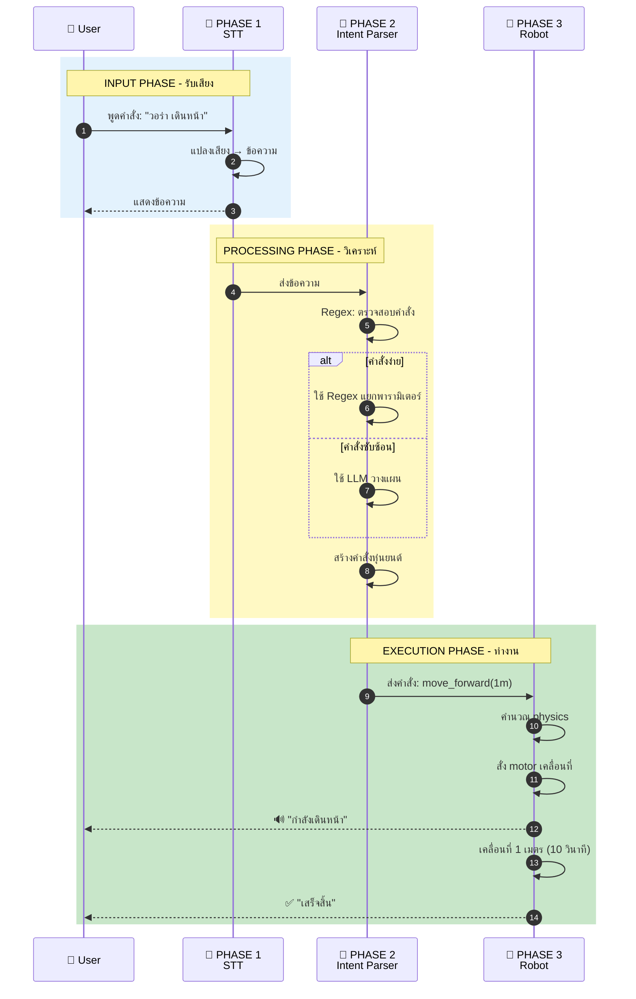

---

## 📊 3. Phase Details - รายละเอียดแต่ละ Phase

### Phase 1: INPUT - Voice to Text (2-3 วินาที)

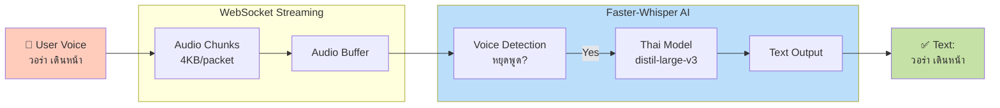

### Phase 2: PROCESSING - Understanding (1-2 วินาที)

```mermaid
flowchart TD
    Input[📝 Text Input<br/>วอร่า เดินหน้า]
    
    Fix[Typo Correction<br/>วัวร่า → วอร่า]
    
    Check{มีคำสั่ง<br/>control?}
    
    subgraph Fast[⚡ Fast Path - Regex]
        R1[Pattern Match<br/>เดิน|หมุน|เลี้ยว]
        R2[Extract Params<br/>distance, angle]
        R3[Generate Command<br/>instant]
    end
    
    subgraph Smart[🤖 Smart Path - LLM]
        L1[LLM Analysis<br/>Gemma3 AI]
        L2[Multi-step Plan<br/>Step 1, 2, 3...]
        L3[Generate Commands<br/>sequenced]
    end
    
    Output[📤 Robot Command<br/>JSON]
    
    Input --> Fix
    Fix --> Check
    Check -->|เดิน/หมุน| Fast
    Check -->|ซับซ้อน| Smart
    R1 --> R2 --> R3
    L1 --> L2 --> L3
    R3 --> Output
    L3 --> Output
    
    style Fast fill:#c8e6c9
    style Smart fill:#ffe0b2
```

### Phase 3: EXECUTION - Robot Action (5-15 วินาที)

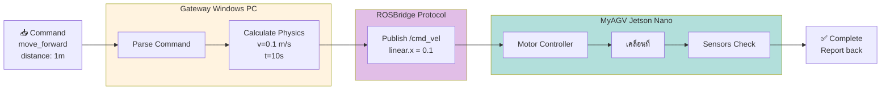

---

## 🎭 4. Innovation Highlight - Hybrid Intent Parser

**⚠️ ใช้อธิบาย Innovation ของโครงการ**

```mermaid
flowchart TD
    Start([User Input Text])
    
    Stage1{🔍 Stage 1<br/>Regex Check}
    
    subgraph Traditional[❌ Traditional Approach<br/>LLM Only - Slow 3-5s]
        T1[Send to LLM]
        T2[Wait for response]
        T3[Parse result]
    end
    
    subgraph Our[✅ Our Hybrid Approach<br/>Regex + LLM - Fast 0.5s]
        O1[Regex Pattern<br/>เดิน|หมุน|เลี้ยว]
        O2[Extract Params]
        O3[Instant Result]
    end
    
    LLM[🤖 LLM<br/>for complex only]
    
    Result[Command Output]
    
    Start --> Stage1
    Stage1 -->|80% Simple| Our
    Stage1 -->|20% Complex| LLM
    
    O1 --> O2 --> O3 --> Result
    LLM --> Result
    
    Traditional -.->|We don't use this| T1
    T1 -.-> T2 -.-> T3
    
    style Our fill:#c8e6c9
    style Traditional fill:#ffcdd2
    style LLM fill:#ffe0b2
```

---

## 🏗️ 5. System Architecture Overview (Original)

### เวอร์ชัน A: พร้อม Emoji (แนะนำ - สวยงาม)

**⚠️ Copy ตั้งแต่บรรทัด `graph TB` ถึง `fill:#f3e5f5` เท่านั้น**

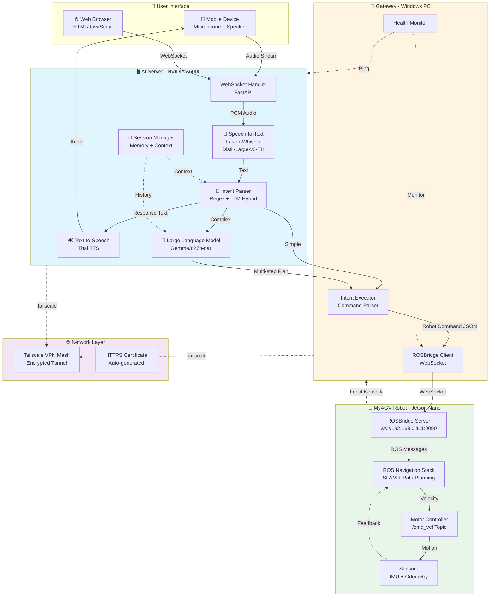

### เวอร์ชัน B: ไม่มี Emoji (สำหรับ parser ที่มีปัญหา)

**⚠️ หาก Mermaid ขึ้น error ให้ใช้เวอร์ชันนี้แทน**

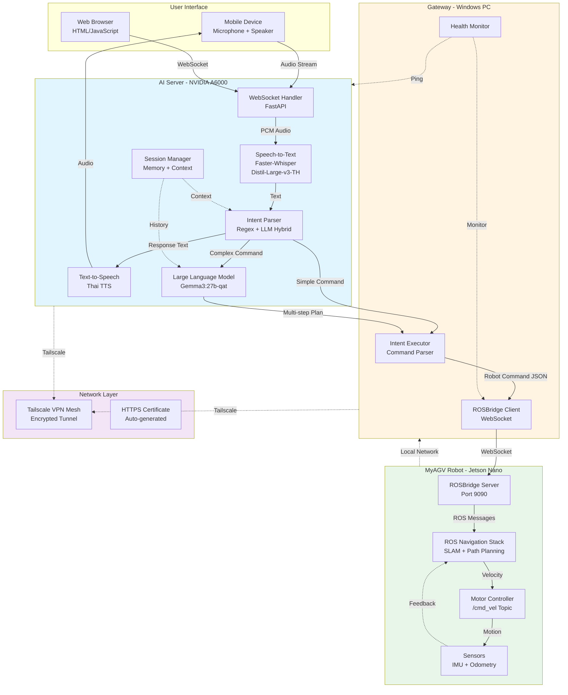

---

## 2. Detailed Workflow - Voice Command Processing

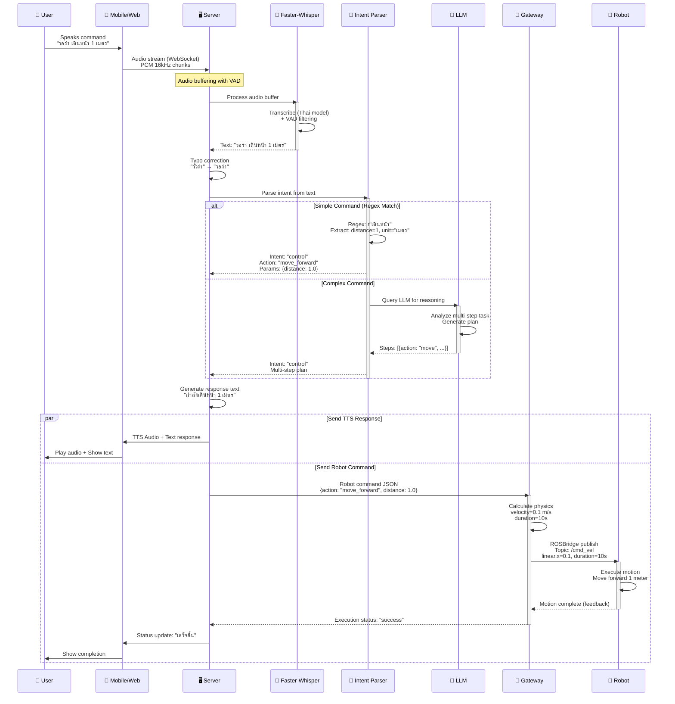

---

## 3. Intent Classification Flow (Hybrid Approach)

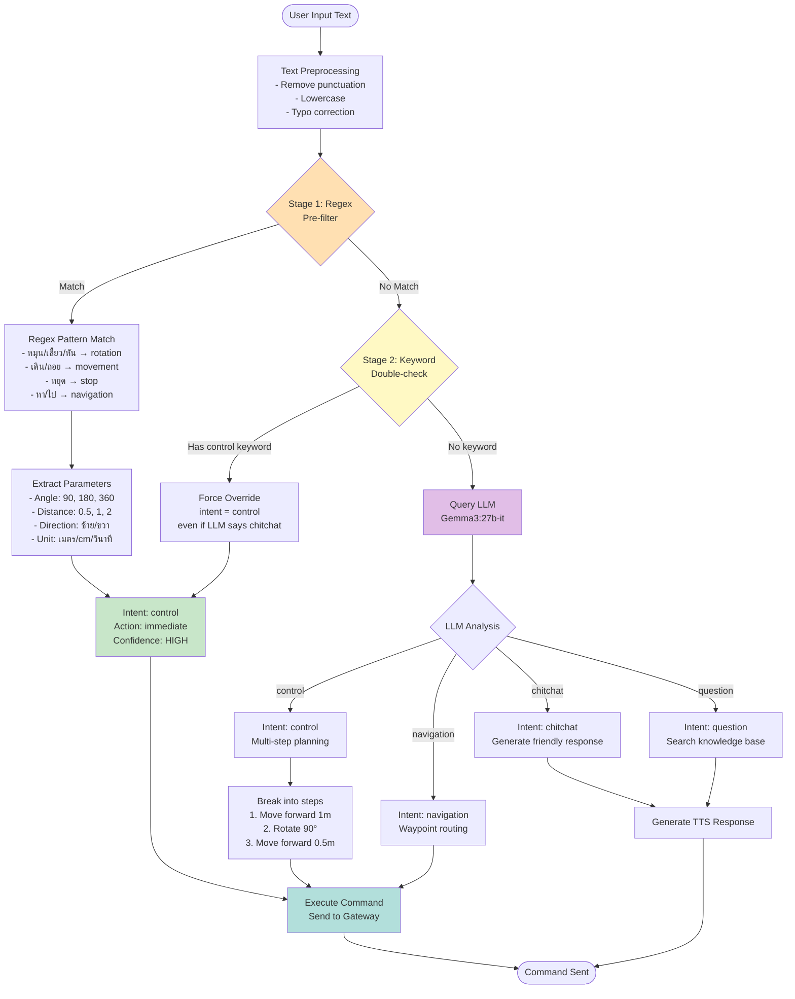

---

## 4. Robot Motion Control - Physics Calculation

```mermaid
flowchart LR
    subgraph Input[User Command]
        Cmd["เลี้ยวขวา 90 องศา"]
    end
    
    subgraph Parser[Command Parser]
        Extract[Extract Parameters<br/>- Action: rotate<br/>- Angle: 90<br/>- Direction: right ขวา]
    end
    
    subgraph Physics[Physics Calculation]
        Convert[Convert to radians<br/>90° = π/2 = 1.571 rad]
        Calibrate[Apply calibration<br/>FACTOR = 0.857<br/>adjusted = 1.571 * 0.857]
        Calc[Calculate duration<br/>duration = angle_rad / angular_vel<br/>= 1.346 / 0.3 rad/s<br/>= 4.49 seconds]
    end
    
    subgraph ROSCmd[ROS Command]
        Build[Build /cmd_vel message<br/>linear: {x:0, y:0, z:0}<br/>angular: {x:0, y:0, z:-0.3}]
        Publish[Publish for duration<br/>4.49 seconds]
    end
    
    subgraph Execution[Motor Execution]
        Motor[Motor Controller<br/>Spin right at 0.3 rad/s]
        Monitor[Monitor with IMU<br/>Track actual rotation]
        Stop[Stop motors<br/>after duration]
    end
    
    subgraph Feedback[Feedback Loop]
        Check{Rotation<br/>accurate?}
        Success[Report success]
        Adjust[Adjust calibration<br/>for next command]
    end
    
    Input --> Parser
    Parser --> Physics
    Convert --> Calibrate
    Calibrate --> Calc
    Physics --> ROSCmd
    Build --> Publish
    ROSCmd --> Execution
    Motor --> Monitor
    Monitor --> Stop
    Execution --> Feedback
    Check -->|Yes| Success
    Check -->|No| Adjust
    Adjust -.->|Update| Calibrate
    
    style Physics fill:#e3f2fd
    style Execution fill:#f3e5f5
    style Feedback fill:#fff3e0
```

---

## 5. STT Processing Pipeline - Latency Optimization

```mermaid
graph LR
    subgraph User[User Audio Input]
        Mic[🎤 Microphone<br/>ReSpeaker USB<br/>44.1kHz stereo]
    end
    
    subgraph Preprocessing[Audio Preprocessing]
        FFmpeg[FFmpeg Conversion<br/>→ 16kHz mono PCM<br/>→ 16-bit samples]
        Chunk[Chunk into 4KB blocks<br/>~0.1s per chunk]
    end
    
    subgraph Streaming[WebSocket Streaming]
        WS[WebSocket Connection<br/>wss://server/ws/stt]
        Buffer[Server-side Buffer<br/>Accumulate chunks]
        VAD[Voice Activity Detection<br/>Detect silence threshold]
    end
    
    subgraph STT[Faster-Whisper Engine]
        Load[Load Model<br/>distil-whisper-th-large-v3-ct2<br/>CUDA FP16]
        Transcribe[Transcribe with VAD<br/>- threshold: 0.5<br/>- min_speech: 250ms]
        Filter[Filter hallucinations<br/>Remove repeated segments]
    end
    
    subgraph Output[Text Output]
        Text[Transcribed Text<br/>"วอร่า เดินหน้า"]
        Latency[⏱️ Total Latency<br/>2-3 seconds]
    end
    
    Mic --> FFmpeg
    FFmpeg --> Chunk
    Chunk --> WS
    WS --> Buffer
    Buffer --> VAD
    VAD -->|Silence detected| Transcribe
    Load -.->|Model ready| Transcribe
    Transcribe --> Filter
    Filter --> Text
    Text --> Latency
    
    style Streaming fill:#e8f5e9
    style STT fill:#e1f5fe
    style Latency fill:#ffeb3b
```

---

## 6. Network Topology - Tailscale VPN Mesh

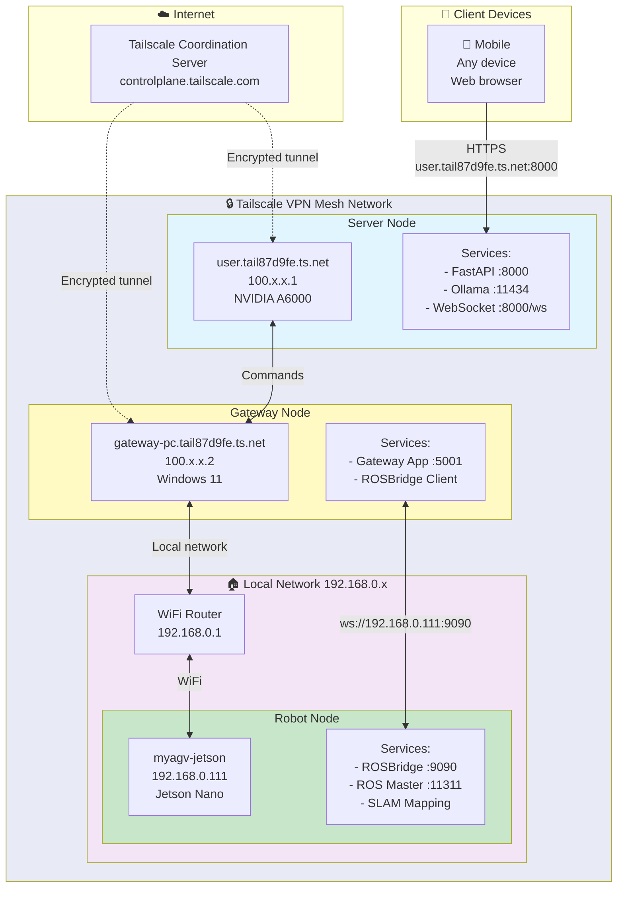

---

## 7. Multi-Step Command Execution

```mermaid
stateDiagram-v2
    [*] --> ReceiveCommand: User: "เดินหน้าแล้วเลี้ยวขวา"
    
    ReceiveCommand --> ParseIntent: STT Complete
    
    ParseIntent --> DetectMultiStep: Intent Parser
    
    DetectMultiStep --> LLMPlanning: Complex command detected
    
    LLMPlanning --> GenerateSteps: LLM breaks into steps
    
    GenerateSteps --> QueueSteps: Queue: [Step1, Step2]
    
    QueueSteps --> ExecuteStep1: Execute Step 1
    
    state ExecuteStep1 {
        [*] --> Move: "เดินหน้า"
        Move --> CalculatePhysics: distance = 1m (default)
        CalculatePhysics --> SendROS: linear.x = 0.1, t = 10s
        SendROS --> WaitComplete: Motor running
        WaitComplete --> [*]: Motion done
    }
    
    ExecuteStep1 --> CheckQueue: Step 1 complete
    
    CheckQueue --> ExecuteStep2: More steps remain
    
    state ExecuteStep2 {
        [*] --> Rotate: "เลี้ยวขวา"
        Rotate --> CalculateRotation: angle = 90° (default)
        CalculateRotation --> SendROSRotate: angular.z = -0.3, t = 4.5s
        SendROSRotate --> WaitRotate: Motor spinning
        WaitRotate --> [*]: Rotation done
    }
    
    ExecuteStep2 --> CheckQueue2: Step 2 complete
    
    CheckQueue2 --> AllComplete: Queue empty
    
    AllComplete --> SendFeedback: TTS: "เสร็จสิ้นครับ"
    
    SendFeedback --> [*]
    
    CheckQueue --> [*]: Error occurred
```

---

## 8. Error Handling & Recovery Flow

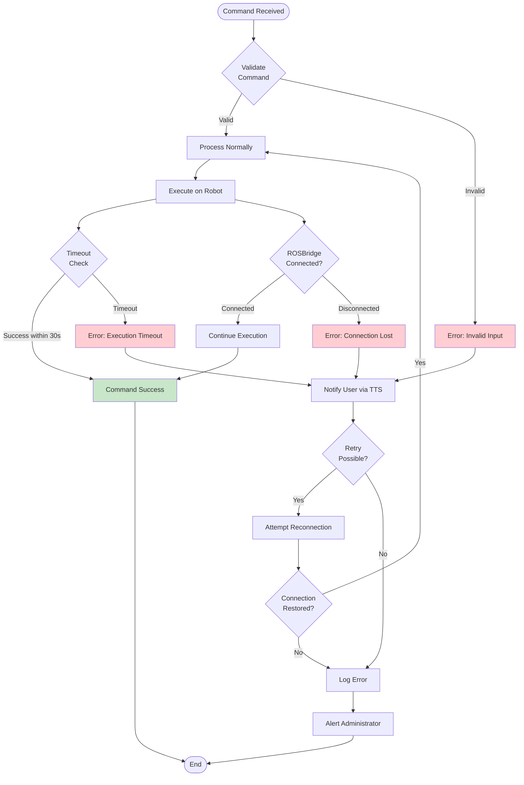

---

## 9. System Components & Technologies

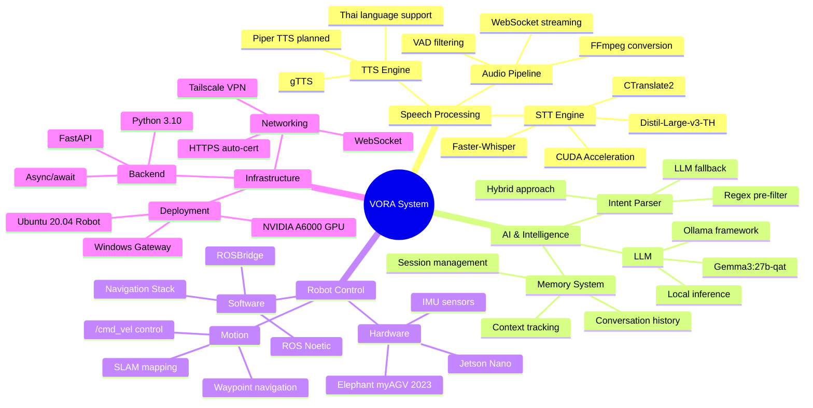

---

## 10. Data Flow Architecture

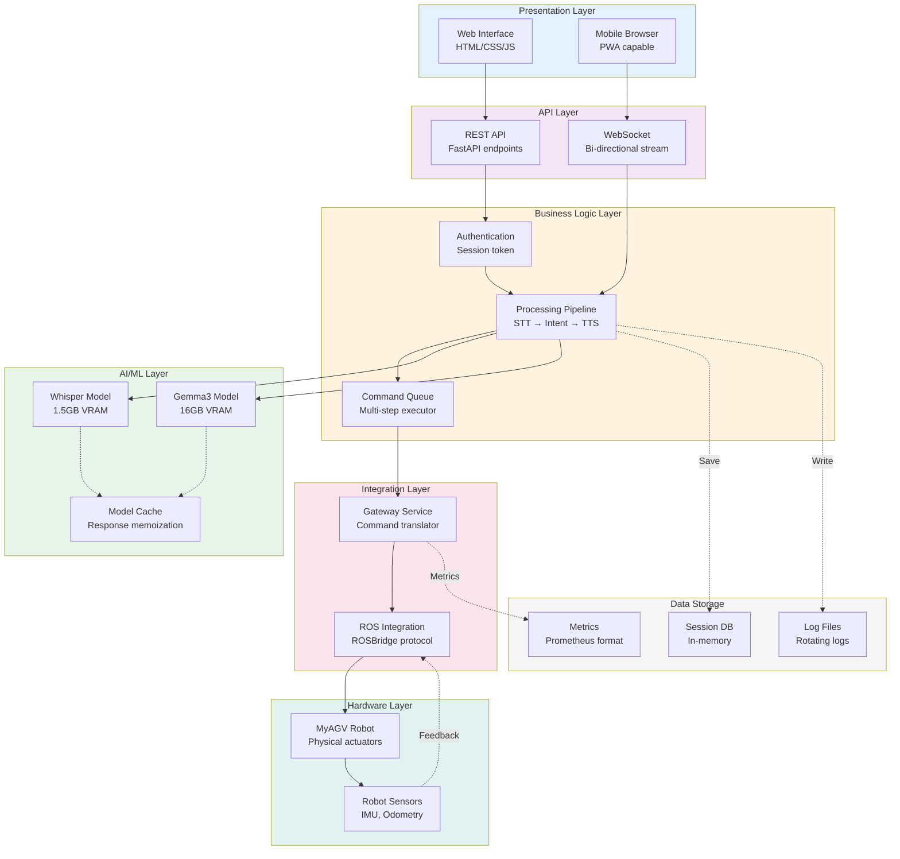

---

## วิธีใช้งาน Diagrams เหล่านี้:

1. **Copy code** จาก diagram ที่ต้องการ
2. ไปที่ **[mermaid.live](https://mermaid.live)** หรือ **[mermaidchart.com](https://www.mermaidchart.com)**
3. **Paste** code ลงไป
4. **Export** เป็น PNG/SVG/PDF สำหรับนำเสนอ

### Diagram แนะนำสำหรับการนำเสนอ:

- **Diagram 1**: System Architecture - ภาพรวมทั้งระบบ
- **Diagram 2**: Workflow Sequence - กระบวนการทำงานแบบละเอียด
- **Diagram 3**: Intent Classification - อธิบาย Hybrid approach ที่เป็น innovation
- **Diagram 6**: Network Topology - แสดงการ deployment จริง
- **Diagram 7**: Multi-Step Execution - แสดงความสามารถ advanced feature

### สีที่ใช้:
- 🔵 น้ำเงิน: AI/ML components
- 🟡 เหลือง: Gateway/Middleware
- 🟢 เขียว: Robot/Hardware
- 🟣 ม่วง: Network/Infrastructure
